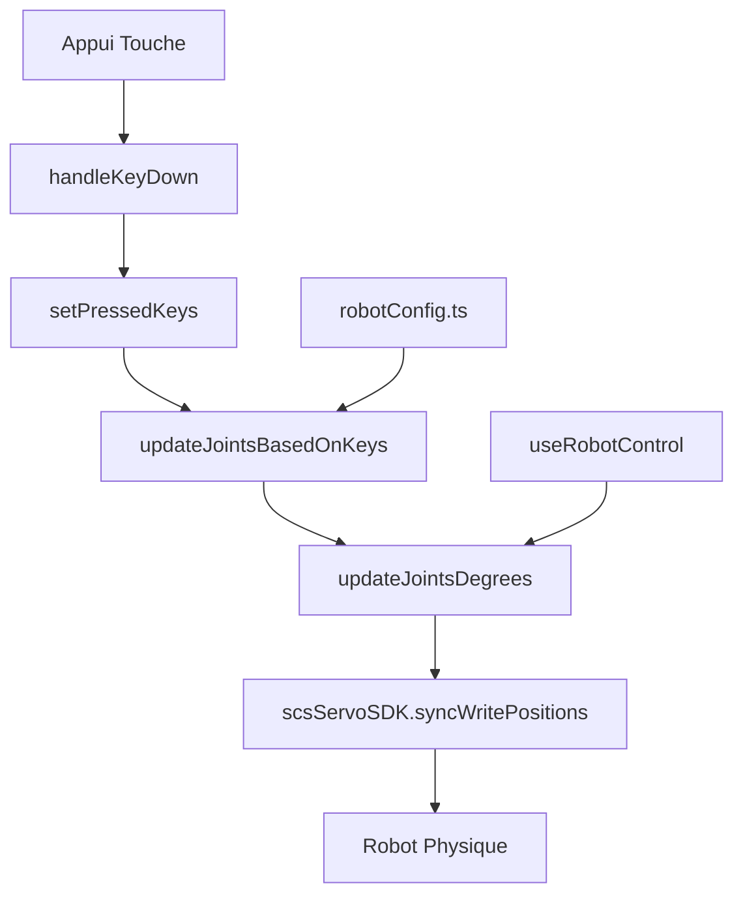

# 🎹 Système de Contrôle Clavier - Documentation Technique

## Vue d'ensemble

Le système de contrôle clavier permet de piloter le robot SO101 en temps réel via des touches du clavier. Chaque servo moteur est mappé à des touches spécifiques pour un contrôle précis et fluide.

## 🏗️ Architecture du Système

### Composants Principaux



### Stack Technologique

- **Frontend**: React + TypeScript
- **Contrôle Temps Réel**: `setInterval` (3ms)
- **Communication Robot**: `feetech.js SDK`
- **Configuration**: `robotConfig.ts`

## ⚙️ Configuration du Mapping

### Structure du Mapping (robotConfig.ts)

```typescript
keyboardControlMap: {
  servoId: [increasKey, decreaseKey]
}
```

### Exemple SO101

```typescript
keyboardControlMap: {
  1: ["1", "q"],  // Rotation: "1" (droite) / "q" (gauche)
  2: ["2", "w"],  // Pitch: "2" (haut) / "w" (bas)
  3: ["3", "e"],  // Elbow: "3" (haut) / "e" (bas)
  4: ["4", "r"],  // Wrist Pitch: "4" (haut) / "r" (bas)
  5: ["5", "t"],  // Wrist Roll: "5" (droite) / "t" (gauche)
  6: ["6", "y"],  // Jaw: "6" (ouvert) / "y" (fermé)
}
```

### Mapping Physique

| Servo ID | Joint | Touche + | Touche - | Description |
|----------|-------|----------|----------|-------------|
| 1 | Rotation | `1` | `q` | Rotation de la base |
| 2 | Pitch | `2` | `w` | Élévation de l'épaule |
| 3 | Elbow | `3` | `e` | Flexion du coude |
| 4 | Wrist Pitch | `4` | `r` | Flexion du poignet |
| 5 | Wrist Roll | `5` | `t` | Rotation du poignet |
| 6 | Jaw | `6` | `y` | Ouverture/fermeture pince |

## 🔄 Flux de Contrôle Détaillé

### 1. Détection des Touches

**Fichier**: `RevoluteJointsTable.tsx:100-109`

```typescript
const handleKeyDown = (event: KeyboardEvent) => {
  const isControlKey = Object.values(keyboardControlMapRef.current || {})
    .flat()
    .includes(event.key);
  if (isControlKey) {
    // event.preventDefault(); // Optionnel
  }
  setPressedKeys((prevKeys) => new Set(prevKeys).add(event.key));
};
```

**Fonctionnement**:
- Écoute globale des événements clavier
- Vérification si la touche est mappée
- Ajout à l'ensemble des touches pressées

### 2. Boucle de Contrôle Continue

**Fichier**: `RevoluteJointsTable.tsx:299-301`

```typescript
if (pressedKeys.size > 0) {
  intervalId = setInterval(updateJointsBasedOnKeys, KEY_UPDATE_INTERVAL_MS);
}
```

**Paramètres**:
- **Fréquence**: `3ms` (333 Hz)
- **Condition**: Tant qu'au moins une touche est pressée

### 3. Calcul des Mouvements

**Fichier**: `RevoluteJointsTable.tsx:146-159`

```typescript
currentJoints.map((joint) => {
  const decreaseKey = currentControlMap[joint.servoId!]?.[1];
  const increaseKey = currentControlMap[joint.servoId!]?.[0];
  let currentDegrees = typeof joint.degrees === "number" ? joint.degrees : 0;
  let newValue = currentDegrees;

  if (decreaseKey && currentPressedKeys.has(decreaseKey)) {
    newValue -= KEY_UPDATE_STEP_DEGREES; // -0.15°
  }
  if (increaseKey && currentPressedKeys.has(increaseKey)) {
    newValue += KEY_UPDATE_STEP_DEGREES; // +0.15°
  }

  // Application des limites
  const lowerLimit = Math.round(radiansToDegrees(joint.limit?.lower ?? -Infinity));
  const upperLimit = Math.round(radiansToDegrees(joint.limit?.upper ?? Infinity));
  newValue = Math.max(lowerLimit, Math.min(upperLimit, newValue));

  return { servoId: joint.servoId!, value: newValue };
});
```

**Logique**:
1. Récupération des touches mapped pour chaque servo
2. Calcul de la nouvelle position (`±0.15°`)
3. Application des limites physiques
4. Retour des mises à jour nécessaires

### 4. Envoi au Robot

**Fichier**: `useRobotControl.ts:286-324`

```typescript
const updateJointsDegrees: UpdateJointsDegrees = useCallback(
  async (updates) => {
    const newStates = [...jointStates];
    const servoPositions: Record<number, number> = {};

    updates.forEach(({ servoId, value }) => {
      const jointIndex = newStates.findIndex(
        (state) => state.servoId === servoId
      );

      if (jointIndex !== -1 && newStates[jointIndex].jointType === "revolute") {
        newStates[jointIndex].degrees = value;

        if (isConnected && value >= 0 && value <= 360) {
          const servoPosition = degreesToServoPosition(value);
          servoPositions[servoId] = Math.round(servoPosition);
        }
      }
    });

    if (isConnected && Object.keys(servoPositions).length > 0) {
      await scsServoSDK.syncWritePositions(servoPositions);
    }

    setJointStates(newStates);
  },
  [jointStates, isConnected]
);
```

**Étapes**:
1. Mise à jour de l'état local (`jointStates`)
2. Conversion degrés → position servo (0-4095)
3. Envoi groupé au robot via `syncWritePositions`
4. Gestion des erreurs et limites

## 📊 Paramètres de Performance

### Constantes Critiques

```typescript
// RevoluteJointsTable.tsx:21-22
const KEY_UPDATE_INTERVAL_MS = 3;        // 3ms = 333 Hz
const KEY_UPDATE_STEP_DEGREES = 0.15;    // 0.15° par update
```

### Calculs de Performance

- **Fréquence Max**: 333 updates/seconde
- **Vitesse Max**: `0.15° × 333 = 50°/seconde`
- **Précision**: 0.15° = `0.15 × 4095/360 ≈ 1.7 positions servo`

### Conversion Degrés ↔ Servo

```typescript
// lib/utils.ts
export function degreesToServoPosition(degrees: number): number {
  return (degrees / 360) * 4095;
}

export function servoPositionToAngle(position: number): number {
  return (position / 4095) * 360;
}
```

## 🎮 Mouvements Composés

### Configuration Avancée

```typescript
compoundMovements: [
  {
    name: "Jaw down & up",
    keys: ["8", "i"],                    // Touches déclencheuses
    primaryJoint: 2,                     // Servo principal
    primaryFormula: "primary < 100 ? 1 : -1", // Logique conditionnelle
    dependents: [
      {
        joint: 3,
        formula: "primary < 100 ? -1.9 * deltaPrimary : 0.4 * deltaPrimary"
      },
      {
        joint: 4,
        formula: "primary < 100 ? (primary < 10 ? 0 : 0.51 * deltaPrimary) : -0.4 * deltaPrimary"
      }
    ]
  }
]
```

### Variables Disponibles

| Variable | Description | Type |
|----------|-------------|------|
| `primary` | Angle actuel du servo principal | `number` |
| `dependent` | Angle actuel du servo dépendant | `number` |
| `deltaPrimary` | Changement appliqué au servo principal | `number` |

## 🔧 Intégration avec Gamepad

### Mode Exclusif

```typescript
// Désactivation du clavier quand gamepad actif
useEffect(() => {
  if (gamepadActive) {
    return; // Pas d'écoute clavier
  }
  // ... setup keyboard listeners
}, [gamepadActive]);
```

### État Visuel

```typescript
return (
  <div className={`mt-4 ${gamepadActive ? 'opacity-50 pointer-events-none' : ''}`}>
    {gamepadActive && (
      <div className="mb-3 p-3 bg-yellow-50 border border-yellow-200 rounded-lg">
        <span className="font-semibold text-yellow-800">Keyboard Control Disabled</span>
        <div className="text-sm text-yellow-700 mt-1">
          Gamepad control is active. Close the gamepad panel to re-enable keyboard control.
        </div>
      </div>
    )}
    {/* ... interface clavier */}
  </div>
);
```

## 🚨 Gestion des Erreurs

### Limites Physiques

```typescript
// Application automatique des limites
const lowerLimit = Math.round(radiansToDegrees(joint.limit?.lower ?? -Infinity));
const upperLimit = Math.round(radiansToDegrees(joint.limit?.upper ?? Infinity));
newValue = Math.max(lowerLimit, Math.min(upperLimit, newValue));
```

### Validation des Commandes

```typescript
if (value >= 0 && value <= 360) {
  const servoPosition = degreesToServoPosition(value);
  servoPositions[servoId] = Math.round(servoPosition);
} else {
  console.warn(`Value ${value} for servo ${servoId} is out of range (0-360)`);
}
```

### Déconnexion Robot

```typescript
try {
  await scsServoSDK.syncWritePositions(servoPositions);
} catch (error) {
  console.error("Failed to update multiple servo degrees:", error);
  // Mise à jour de l'état avec erreur
  newStates.forEach((state, index) => {
    if (validUpdates.some(update => update.servoId === state.servoId)) {
      newStates[index].degrees = "error";
    }
  });
}
```

## 🎯 Bonnes Pratiques

### Performance

1. **Batch Updates**: Grouper les mises à jour multiples
2. **Validation Early**: Vérifier les limites avant envoi
3. **Error Handling**: Gérer les déconnexions gracieusement

### Maintenance

1. **Configuration Centralisée**: Tout dans `robotConfig.ts`
2. **Types Stricts**: TypeScript pour la sécurité
3. **Separation of Concerns**: UI ↔ Logic ↔ Hardware

### Extensibilité

1. **Mapping Flexible**: Support multi-robots via configuration
2. **Formules Dynamiques**: Mouvements composés programmables
3. **Mode Exclusif**: Intégration gamepad/clavier fluide

## 📝 Debugging

### Logs Utiles

```typescript
// Activité touches
console.log('Pressed keys:', Array.from(pressedKeys));

// Mises à jour servos
console.log('Servo updates:', updates);

// État joints
console.log('Joint states:', jointStates);
```

### Points de Surveillance

1. **Fréquence updates**: Vérifier les 3ms
2. **Limites respectées**: Angles dans les bornes
3. **Connexion robot**: États d'erreur
4. **Performance**: Lag ou freeze

---

*Documentation générée pour bambot v2.0 - Système de contrôle SO101*